# three.js slides prompt

Prompt I used to build a three.js presentation canvas with Claude Code (Opus 5.5). Swap in your own topic and colors and go.

## The prompt

> can you make a localhost three js canvas inspired by style of dark theme, grids, motion graphics, think music videos, space, beautiful typography, impressive, but yet functional for me to add text/cards, and something i can present live and interact with live without lag. the goal is i want to present this canvas, and be able to interactively add text/cards to it, and be able to show some examples. the topic is:
> decreasing mental load when making decisions with AI or maybe its... how to be more confident approving AI changes... or... how to make approving AI feel effortless.  something along those lines where i want to bring up examples of like... well several examples. maybe reviewing a PR, maybe AI finished some work for you and opened a PR, and you want to feel good about it, but its quite complicated and your not sure if you should open it for review yet or not. or maybe ai just makes a bunch a changes, and you want to feel more confident, but its difficult because it looks complex or it touches a lot of important files, or your really not 100% if its going to have a regression. maybe you can think of a topic that fits that.
> primary colors are some bg that is close to a darkbg, and then for primary colors dark rgb(42, 107, 79)  light rgb(16, 185, 129), white
> some examples i have of solving the problems are -
> start with base example of maybe default expectaion with a default prompt, like "how is this pr?", or "can you fix this issue and make a draft pr?" the simple questions.
> some strategies could be - can you have another agent review this and lets discuss?   maybe its adding screenshots to the pr.  maybe its telling the agent to split the pr up into no-brainer approval PRs to decrease cognative load. maybe its making an interactive localhost thing for the purpose of helping understand the work. etc

## Follow-ups

How it got from first draft to done, in 1h 26m. Times are US Central, Oct 8 2026. Typos and all.

### 01 · 12:59 PM · +31m

> for the moment slide - maybe... different title. maybe a cute little claude character pops up with job done! or something, and you in response.. maybe something a human would think about ... i mean it helps to visualize the diff thing as more than just _1284. maybe you want to make it bigger feel like tons of changes. so the human looks at it and is questioning whether its really ok, any regressions

→ added the agent character, the diff wall, and the doubts

### 02 · 1:08 PM · +40m

> can we insert a strategy before the current. which is "are you happy with this?", that was a discussion in a previous meeting so people know about that context. and second part might be the same get a second opinion. or you might include a naive JDD - jealously driven development ([other agent] said blah blah), which is silly but fun, but you can ask the same agent to spin up its own second agent. or even ask that other agent if their happy. and the evolution of that is also something i tried which is a review-loop skill to keep spinning up a new agent to review until there is no correctness fix. figure out how to add that into the mix

→ added "are you happy?", second opinion levels, and the review loop

### 03 · 1:09 PM · +41m

> btw the jdd thing is on my desktop if you want to reference it, up to you

→ used the real JDD prompt and screenshot

### 04 · 1:10 PM · +42m

> and maybe the last slide after the open up for discussion slide is how this was made, the exact prompts and followup prompts i used

→ added this section

### 05 · 1:21 PM · +53m

> for the moment slide, my comments, my thoughts are more like... how do i know this causes 0 regressions. is this the right approach?  i dont fully understand what its doing...  even if AI tells me it's good I still dont feel good about it

→ rewrote the doubts in my own words

### 06 · 1:22 PM · +54m

> and for "how is this pr?" the agent usually does a good job at leaving crituqe, it rarely says lgtm in practice. but usually its comments .. theres quite a lot.. and i dont fully know if it makes more confident

→ swapped "LGTM" for a wall of 14 comments and no verdict

### 07 · 1:27 PM · +1h 0m

> review loop needs correcting, need to explain the concept. the concept is... the agent you are chatting with, .. instead of you reaching for another agent to see what it thinkgs, just tell the agent you're chatting with to do what you would have done. but in a loop, until there is no correctness fix, and KEY, you must not agree to everything it suggests, you have more context than it. you need 2 agents to pass in a row with no correctness fix before proceeding. thats the concept. it also exposes that a fresh reviewer often suggests things that you already thought through and decided against

→ rebuilt the loop: triage, pushback, two clean passes

### 08 · 1:33 PM · +1h 5m

> some of the prompts could be simplified
> e.g.
> "have another agent review this" is enough
> or "ask another agent if its happy with this"
> or "do a loop asking a nother agent thoughts on this pr until there is no correctness fix 2 times in a row. dont trust everything they say use your best judgement"

→ shortened every prompt

### 09 · 1:38 PM · +1h 10m

> split into no brainers slide , the black box is overlapping the title. and the localhost thing, maybe you want to make a canvas/uml instead. maybe the prompt should be, make me a localhost canvas to help break down this work for me or something, so the preview is not a 1 2 3 4. its more like a uml

→ drew a UML canvas of the PR

### 10 · 1:39 PM · +1h 12m

> prove it  could instead be like... prove with artifacts. a QA checklist, a consumer PR using it, new CI tests, something tangable. it could be a sandbox or put you into the exact situation or a flag so you can see before after easily, many methods

→ turned "prove it" into six artifacts

### 11 · 1:45 PM · +1h 17m

> instead of ask for verdict. hmm. put all proof in the draft PR, the one place to look ? iterate on the draft PR with the agent until its ready for others

→ new strategy: one place to look

### 12 · 1:45 PM · +1h 18m

> basically proof should be public, not in chat
> not only is it for your eyes, but reveiwers
> it should feel easy for both you and reviewers

→ "proof is public, not in chat"

### 13 · 1:52 PM · +1h 25m

> the "split this into PRs i can approve black box prompt, is overalpping the title Split into no brainers.
> also in how this was made, dont include the music video part. also you can include more of the discussion if you think its a good idea

→ fixed the overlap and built this feed

### 14 · 1:54 PM · +1h 26m

> can you put timestamps too

→ added these timestamps

## What it made

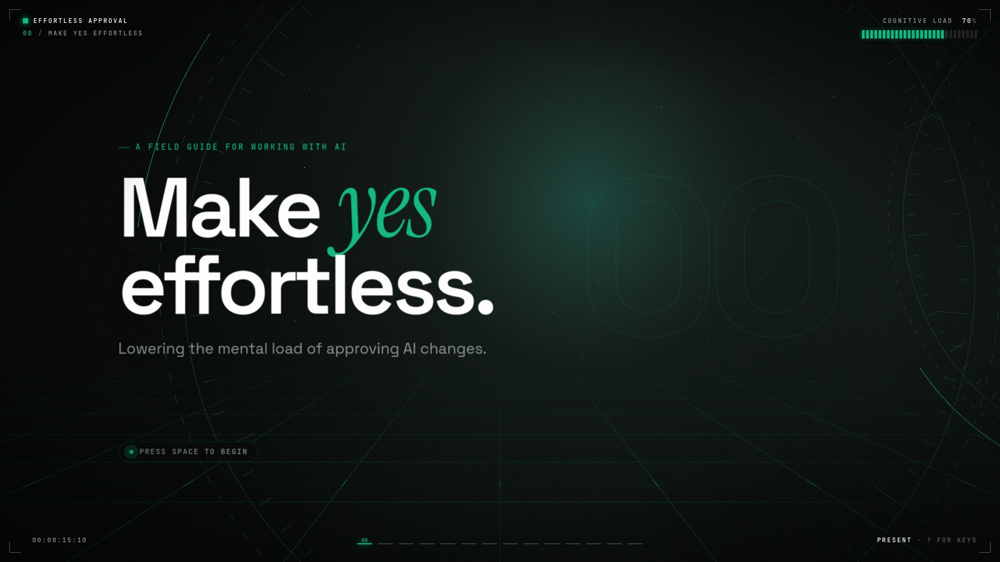

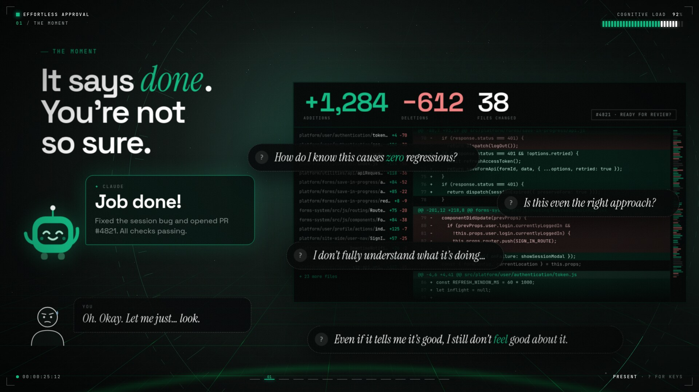

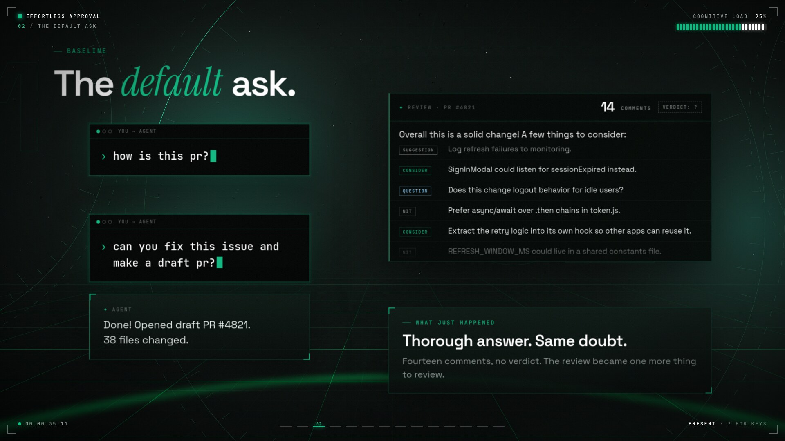

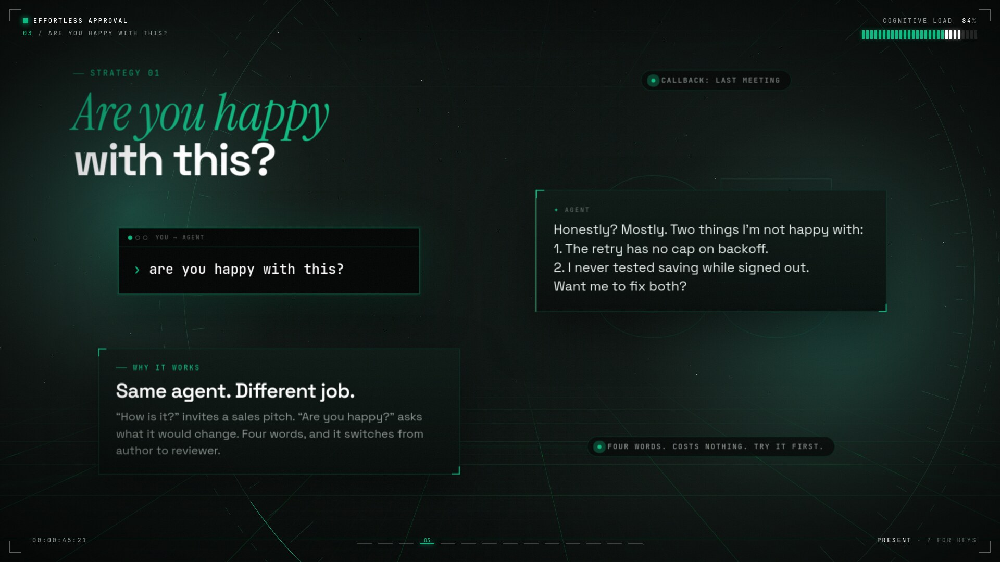

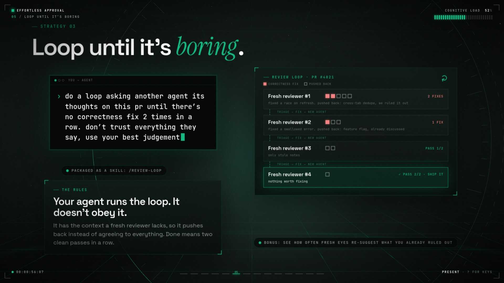

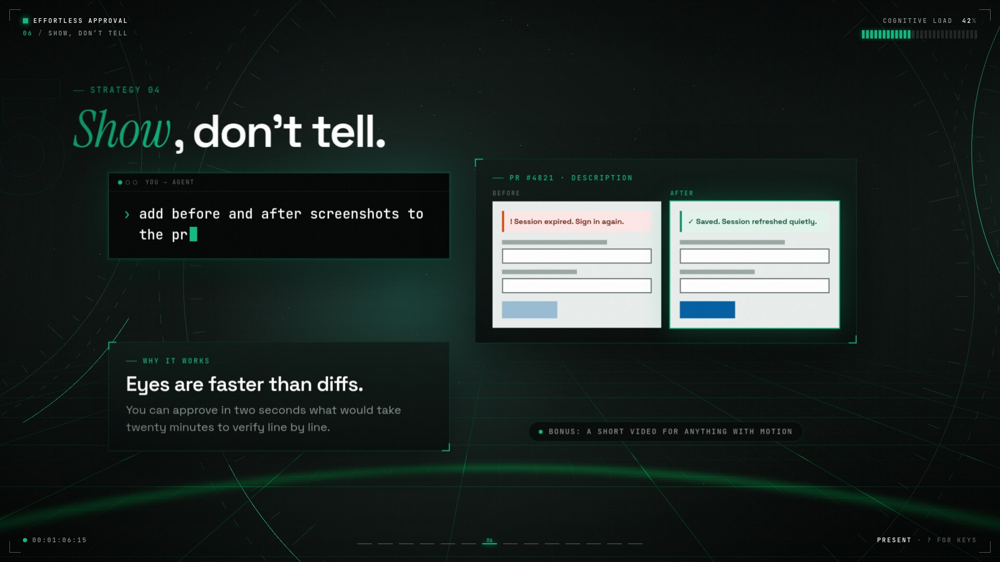

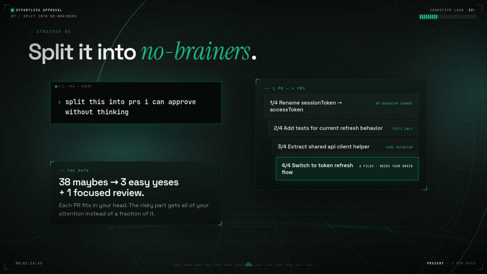

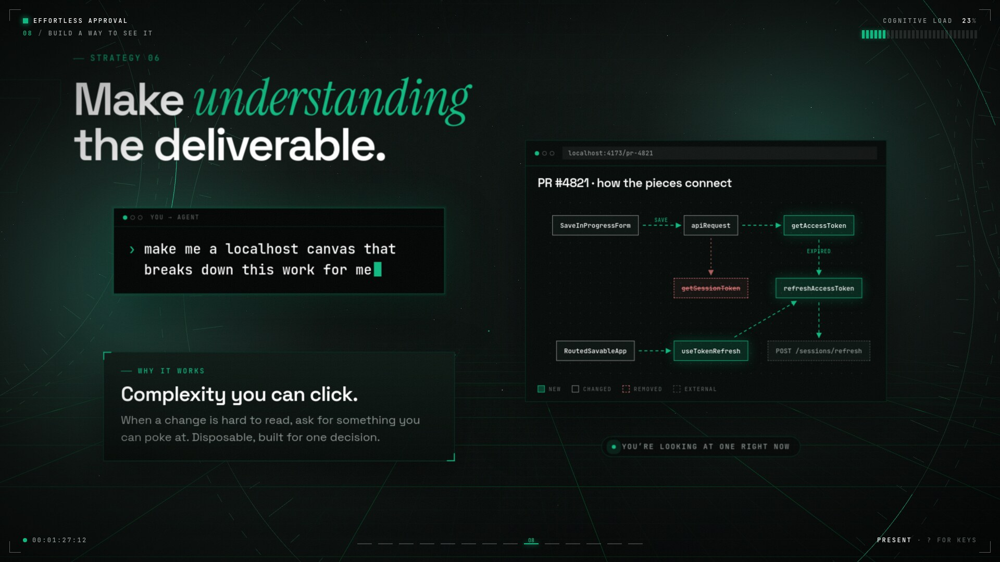

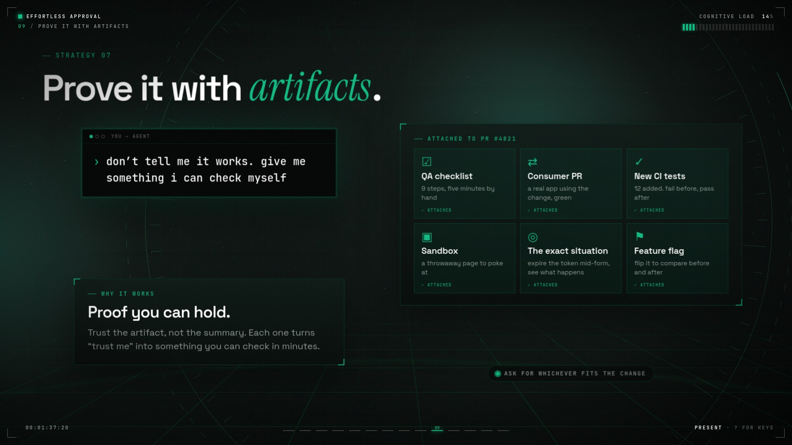

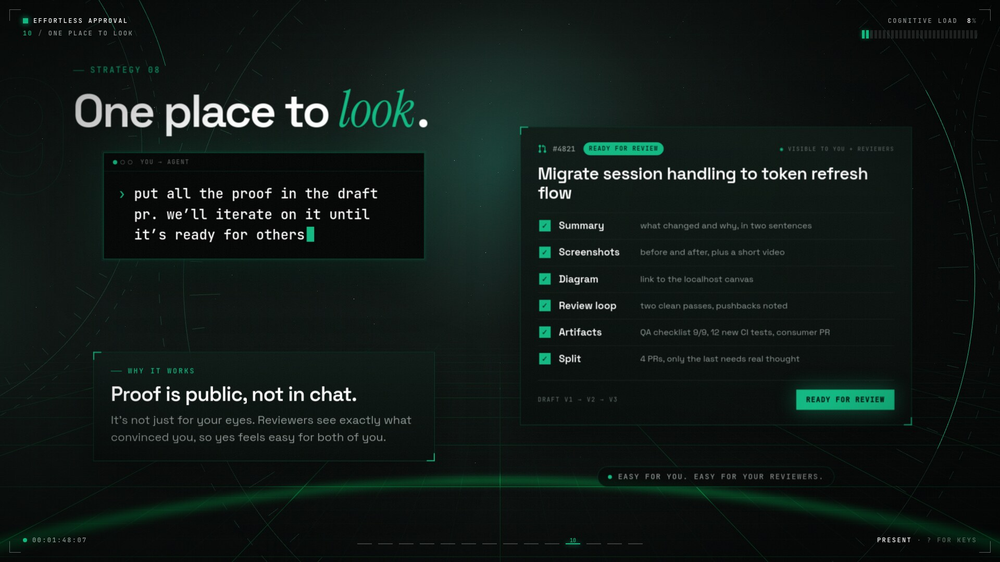

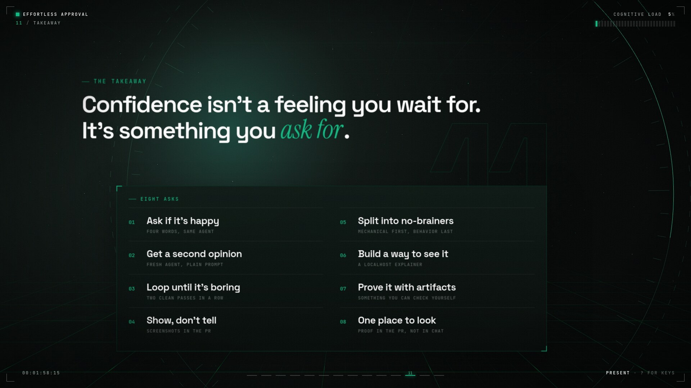

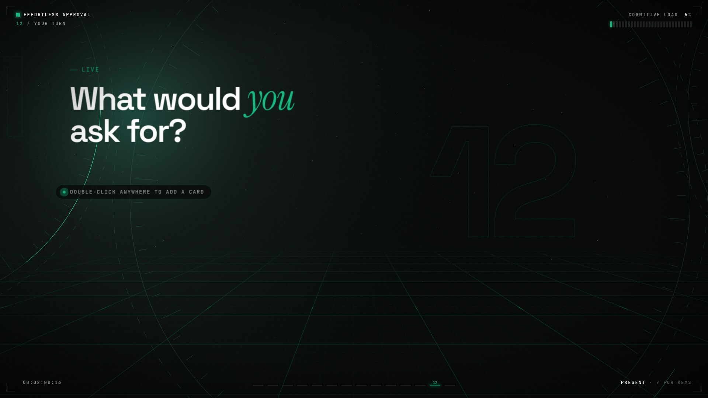

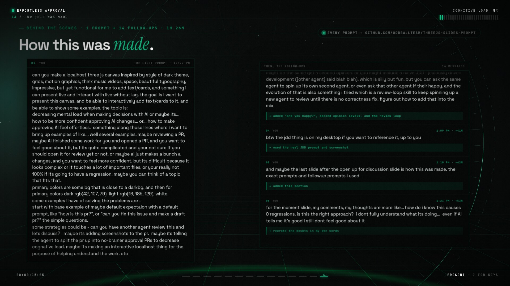
